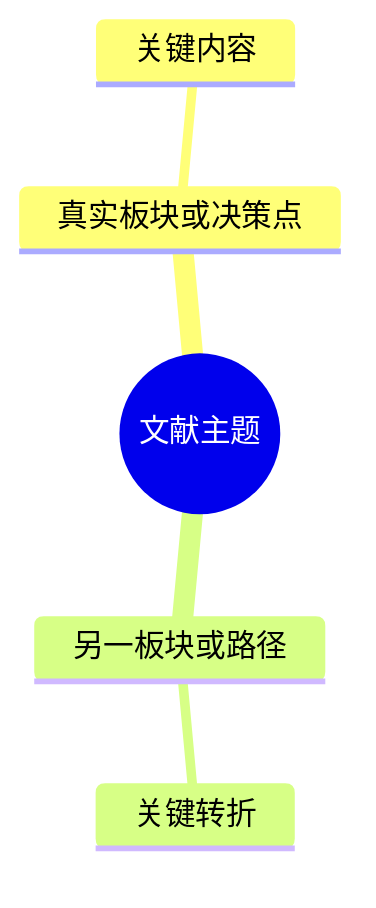

# 医学文献解读图表

图表服务于单篇或多篇文献理解，而不是展示模板完整度。先确认图表要回答的问题，再决定是否使用；所有节点、关系、数值和比较项都必须来自目标来源集合。

## 全局导读图

每份 Full Report 在原文解读主章节之前生成一张全局导读图；章节标题和图型随文献类型动态生成：

- 研究论文可用“文章结构与研究逻辑”，呈现问题、设计、结果与解释如何衔接；
- 指南或共识可用“指南框架与临床路径”，呈现适用人群、分层入口、推荐分支与随访；
- 综述可用“主题脉络与证据版图”，病例可用“病例进程与推理主线”，技术文献可用“技术流程与关键节点”。
- 多篇汇总、逐篇解读或比较可用“多篇证据关系图”“研究演进图”或“比较逻辑图”，呈现各文献在核心问题中的角色、一致、补充、限制或冲突；节点数量服从主要证据，不要求每篇等大或等量展示。

全局导读图的根节点写文献主题或核心任务。一级分支优先来自真实章节、主题板块、决策点或主要论证步骤。

- 二级及更深层级根据文献内容自然展开，可表示关键概念、研究路径、推荐分支、主要结果、争议或限制。
- 不固定“背景—方法—结果—讨论”，也不规定分支数、节点数或层级深度。
- 研究论文优先保持论证链；指南优先保持临床决策链；叙事综述可按主题与论证关系组织；病例可按时间与推理节点组织。
- 全局导读图只呈现全篇主线，不把所有细节和数字塞入节点。

层级关系适合用 `mindmap`：



指南存在明确 if/then 分支时优先用简洁 `flowchart` 或决策路径；没有真实条件分支时可用层级图，不能为了像临床路径而虚构决策节点。若 `mindmap` 渲染失败，先改为简化的 `flowchart LR` 树状图并重试。全局导读图是第一张必需白板，但不能代替下述重点内容图。

## Full Report 视觉最低项

每份 Full Report 至少包含：

1. 一张全局导读图，呈现当前文献的整体论证、主题、临床决策、病例进程或技术主线。
2. 全局图之外，至少一张位于原文解读主章节的重点内容图。该图必须用飞书白板表达文献中的具体时间、流程、机制、因果、决策、验证或操作关系，不能只是重复全篇框架。

Quick Answer 不适用上述最低项；只有表格或简图能明显降低理解成本时才按需使用。

## 重点内容图

先在原文解读主章节中对应的二、三级小节用正文讲清文献内容、关键证据和读图重点，再选最小合适图型。

| 文献中真正需要解释的关系 | 优先图型 |
|---|---|
| 综述实际呈现了研究进展、阶段或关键里程碑 | 时间轴图；按年份或阶段组织关键研究与贡献 |
| 主题、观点、证据或机制如何相互支持和限制 | 逻辑图、关系图或机制图 |
| 研究对象如何纳入、分组、干预和随访 | 研究流程图 |
| 条件、阈值或推荐如何改变下一步 | 决策树或路径图 |
| 病例、技术或风险事件如何随时间演变 | 临床时间线或操作流程图 |
| 检测、模型或证据如何经历开发、验证和应用 | 验证流程图或转化链 |
| 暴露、混杂、中介和结局之间的假设关系 | 因果路径图；必须标明这是作者模型或本次方法学重建 |
| 多篇文献如何共同支持、补充或限制结论 | 证据关系图；节点标明文献简称/年份和证据角色 |
| 多篇结论为何不同 | 比较逻辑图；连接人群、设计、终点、时间窗或实施情境与差异 |

### 综述的关键研究里程碑时间轴

综述类文章经常通过多项代表研究说明领域如何演进。只要当前综述正文、图表或可见参考文献讨论中提供了可核验的年份、研究阶段和增量贡献，就优先把时间轴作为原文解读主章节中的重点内容图；若文章重点是机制关系且没有清楚时间脉络，再改用机制图或主题关系图。

绘图前先从当前综述整理一份节点草稿：

`年份或阶段｜研究简称｜研究类型或主题｜核心贡献｜里程碑意义｜原文位置`

- 只选择真正推动机制认识、方法验证、临床转化、指南/实践变化或重要争议的代表节点，不把每一篇被引文献都塞进时间轴。
- 节点优先使用综述原文给出的试验名、作者—年份简称或可读研究简称；贡献写成一个短语，意义可用“奠定基础”“完成验证”“扩展人群”“改变实践”“提出争议”“最新进展”等。
- 时间轴节点保留研究名称/简称和年份即可；重要研究的论文题目及原文已有 DOI、原参考链接、试验号或试验注册链接应放在相邻正文中，避免图中保留了研究简称而正文失去可追踪入口。
- 经典节点不受年份限制；“最新进展”使用综述实际覆盖的最近研究，不自行补检索截止日之后的新文献。
- 年份节点超过 7 个、跨度超过约 8–10 年，或多个年份各只有一项研究时，把相邻年份合并为“早期基础研究”“机制验证阶段”“关键临床研究阶段”“临床转化阶段”“近年进展”等阶段。每个阶段尽量放 2–5 个代表节点。
- 时间轴节点必须能在综述正文、图表或参考文献讨论中反查；原文只给先后关系而没有年份或阶段时，改用研究进展流程图。

优先使用 Mermaid `timeline`，标题写清主题和起止年份或阶段。示例：

```xml
<whiteboard type="mermaid">
timeline
    title 研究主题关键研究里程碑
    早期基础研究 : Smith 2008：提出核心机制
                 : Lee 2011：完成初步人群验证
    临床验证阶段 : Trial A 2016：验证主要临床结局
                 : Cohort B 2018：扩展适用人群
    近年进展 : Review C 2022：整合现有证据
             : Study D 2024：提出新的转化方向
</whiteboard>
```

Mermaid 源码必须像上例一样使用真实换行和缩进。不要把字面量 `/n` 或 `\n` 写进白板充当换行，也不要把整张时间轴压成一行。若 `timeline` 在当前环境不可用，可改用保持“横向年份/阶段轴 + 各阶段代表研究节点”的简洁 `flowchart LR`，但不要退化成普通研究流程图。

指南的两张图必须回答不同尺度的问题：全局导读图呈现完整指南框架或诊疗路径；重点内容图只下钻一个关键推荐分支、治疗选择、监测路径或实施环节。若指南本身不含可重建的完整临床路径，全局图可改为推荐主题层级图，不能自行补齐缺失分支。

指南更新若清楚呈现了“新证据如何引起推荐变化”，重点内容图也可以选择“关键证据 → 推荐新增/修改/撤回 → 受影响人群或临床决策”的关系图；节点只放研究简称、年份和变化要点，重要研究的论文题目及原文已有 DOI、原参考链接、试验号或试验注册链接应放在相邻正文中。来源未建立该关系时不强行绘制。

时间轴有单独的证据门槛：只有原文明示日期、年份、研究阶段、访视点或相对时间点时才使用，并原样保留 `基线`、`第 4 周` 等表述。只有先后顺序、没有可核验时间信息时改用流程图；只有章节顺序时仍使用层级结构图。不得用发表年份、常识或外部研究替目标文献补齐时间线。

重点内容图必须：

- 紧邻它解释的原文解读小节，使用具体图题，例如“图 2. 生物标志物从分析验证到临床效用的转化链”；
- 位于该小节解释性正文之后，不以图题或白板作为小节开场，也不替代正文；
- 节点写真实对象、阶段、发现或限制，连线标明步骤、条件、作用或事件；主路径清晰，例外和风险次要可见；
- 来自当前文献；不得因文章类型预设而虚构时间点、机制、因果链、患者流程或研究结果；
- 相关性关系使用“相关”“伴随”等准确措辞，机制或因果关系按来源证据强度表达，并用节点和连线本身呈现关系；
- 与全局导读图回答不同问题，也不把已有表格原样图形化；
- 根据内容使用 `<whiteboard type="mermaid">`、`<whiteboard type="svg">` 或 `<whiteboard type="plantuml">` 等可验证的非空飞书白板块。关系和流程优先使用可绑定节点的路径；时间轴使用“年份/阶段轴 + 关键研究节点”的形式。

森林图、Kaplan–Meier 曲线、ROC 曲线、漏斗图等只有在来源包含可核验数据且当前工具能忠实表达时才生成；不得把普通流程图改名为统计图。

## 重要章节的补充图表

满足全局导读图和重点内容图后，不再设置机械数量。只有图表明显降低理解成本或揭示正文难以快速看出的关系时才增加。

| 要回答的问题 | 首选表达 |
|---|---|
| 事件如何随时间演变 | 时间线 |
| 条件如何改变下一步 | 决策树或流程图 |
| 步骤、关键节点和风险如何对应 | 流程图 |
| 机制或概念如何相互作用 | 逻辑图或关系图 |
| 研究设计和人群如何流转 | 流程图 |
| 两种以上方案、亚组或结果如何比较 | 对比表或矩阵 |
| 数值、推荐条件、研究特征如何并列 | 表格 |

每个补充图表必须：

- 紧邻对应的原文解读小节，并随实际章节层级自然组织；
- 有“图 X”或“表 X”的简短标题；
- 图表后可按需用短段落补充读图重点和边界；
- 不完整重复正文已经逐项讲过的信息；
- 不为填充版面制造原文没有的因果链、决策路径或机制。

## Mermaid 白板

飞书文档使用 `<whiteboard type="mermaid">`。

- `mindmap` 用缩进表达层级，不要求边标签。
- `flowchart`、时间线或决策图的边应标明条件、事件、步骤或证据作用。
- 节点以短语为主，主路径快速可读；风险和例外放在相关节点附近。
- 不放 HTML、Markdown 围栏、工具名、提示词、内部 ID 或来源注释。
- XML 敏感字符改写为文字。
- 使用真实换行和缩进组织源码；不把字面量 `/n`、`\n` 或其他转义字符串当作换行符。

## 表格

- 真二维比较、数值密集结果、指南推荐条件和研究特征优先用表格。
- 表格不是 Full Report 的固定最低项。只有文章中存在值得并列理解的对象、结果、阶段、条件或研究特征，且表格比连续正文更直观时才使用。
- 把表格放在原文解读主章节内最相关的二、三级小节，不固定放在章首。先展开文献实质内容，再用一句自然衔接引出，例如“相关 XX 的对比见下表。”无需预告表格怎样组织或承担什么作用。
- 表题按真实比较对象和所在语境拟定，不要求包含“总结对比”等固定词语。
- 比较对象服从文章内容：试验可比较组别、终点与安全性；综述可比较主题、观点、依据与不确定性；指南可比较推荐、人群、强度与条件；病例可比较阶段、观察、作者推理与替代解释；只有片段时可比较来源支持、原文未报告和可解释边界。
- 多篇文献对比可用文献作为行、关键维度作为列，也可以把临床问题/终点作为行、不同来源作为列。选择更容易看出证据关系的方向，不默认按上传顺序排列。
- 多篇表格只并列真正可比的内容。人群、终点、时间窗或统计尺度不同可直接写明差异，避免把异质结果压成统一数值排名。
- 表头使用 `light-blue` 或 `light-gray`，列名具体，不用“项目一/项目二”。
- 单元格只放完成比较所需的信息；长篇方法学解释留在正文。
- 不能从原文计算出的值写“原文未报告”，不得自行补齐。

## 重点表达

正文亮点、关键结论、风险和不确定性可适度使用高亮块或加粗。字体颜色不是必需的区分手段，不设固定语义分类；图表配色以清晰、克制和可读为准。

## 图表完成检查

- 全局导读图反映的是当前文献的真实信息结构，而不是通用文章模板；
- 多篇任务的全局图准确呈现来源之间的证据角色和关系，没有把引用关系、时间先后或结论差异误画成因果强弱；
- 重要章节的额外图表确有信息增量；
- 每个含图表的内容小节都先有解释性正文，再呈现图表；
- 图表顺序与来源及原文解读主章节的展开顺序一致；
- 每个节点、连接和单元格都能回到来源；
- 正文、图和表没有三重重复；
- 最终 XML 中存在两个用途不同的白板块；如使用表格，同时核对其位置、表题和内容；
- 重点内容图回答了一个具体问题，没有重复全局导读图；
- 每张图有一个清楚目的和具体图题，节点语义明确，流程/关系图的连线有步骤、条件或作用标签；
- 白板源码中没有使用字面量 `/n` 或 `\n` 代替真实换行。
