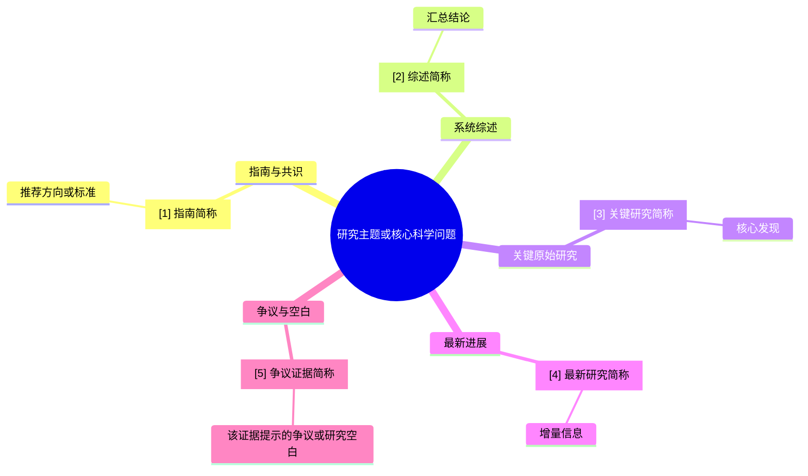
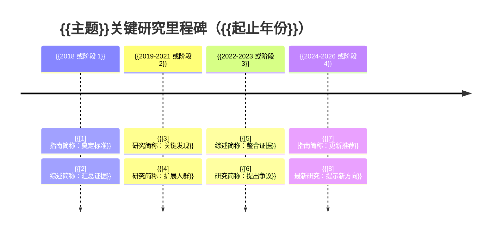

# {{主题}}医学文献循证检索分析报告

<!-- 生成约束：本模板用于用户明确要求 Word/docx 时的内容骨架；通过 lark-doc 的 office-word 模块生成真正 docx。文献写入内部 CSV 时按行顺序生成 citation_number；正文、两图、图例和参考文献直接复用同一 [n]，不再为正文顺序另行规划或重排。用户明确限定只查指南、共识或其他证据类型时，删除范围外章节并顺延编号，不保留空标题，也不补充范围外文献。医学资讯跟踪可围绕时间窗、最新动态、对应证据、证据状态、增量意义和参考文献灵活组章，无独立价值的标准章节或图表可省略；少量纳入的 arXiv、medRxiv 或 bioRxiv 预印本必须标明“预印本/未同行评议”。audience_mode=patient 时解释术语，删除未被用户要求的研究方向、课题建议、证据空白和无关风险内容。全文公式上标使用 Unicode 上标字符（如 ²、³、⁻¹），不得使用 sup 标签；不得使用 ref 标签或其转义形式。阅读状态默认不展示，仅确实阅读全文的重要论文可标注“已阅读全文”。不要把本注释写入正文。 -->

| 文档信息 | 内容 |
|---|---|
| 报告类型 | 医学文献循证检索分析 |
| 任务类型 | {{主题综述/指南查新/热点分析/医学资讯跟踪/课题论证/论文写作/学习资料}} |
| 检索截止日期 | {{日期}} |

> 使用边界：{{audience_mode=professional：本报告为 AI 辅助生成的医学文献循证检索与分析材料，用于学习、科研、论文写作和临床证据讨论参考，不替代临床诊疗决策、伦理审查、正式系统综述、统计分析或人工专家审稿。audience_mode=patient：本报告用于帮助理解公开医学证据，不构成个人诊断或治疗方案，具体判断仍需结合完整病史、检查和临床评估。}}

> **总结：** {{围绕用户提出的问题直接给出当前证据支持的回答、证据确定性和适用边界。首次引用文献名带链接并标注来源/期刊和年份；期刊论文按需标注 Oxford CEBM 2009 级别和本地索引已命中的期刊级别。}}

- **检索结论：** {{概括本次检索得到的核心证据格局，例如指南/共识是否一致、系统综述和关键研究是否支持、最新进展带来何种补充或争议；引用编号从 CSV citation_number 渲染，并与可点击文献名同时出现。}}
- **实践启示：** {{说明这些证据对临床实践、学习、课题设计、论文写作或后续查新的意义；关键启示可加粗突出。}}
- **证据边界：** {{说明证据不确定性、原文不可及、指南冲突或外推限制；仅 professional 模式且任务需要时补充研究空白。}}

## 一、{{根据用户 Query 提炼的回答型专业小标题}}

**问题小结：** {{用 2-4 句话直接概括用户真正关心的问题、当前文献给出的回答、证据确定性和关键边界。}}

{{围绕用户 Query 深入综合指南、系统综述、关键研究和最新进展，形成可直接使用的回答；按实际内容自由生成二三级标题、自然段和无序列表。若用户指定统一对照表、筛选清单、字段结构、呈现顺序或核心文献深度解读，也在本章完整呈现。}}

## 二、证据脉络与研究关系

<!-- 生成约束：图表渲染为图片、原生形状或清晰表格；若保留 Mermaid 代码，紧跟图例表。绘图前先确认 CSV citation_number 已写入并保存。2.1 的根节点以下固定使用“一级证据分类 -> 二级带编号文献 -> 三级该文献产生的结论”，每条文献至少有一个结论节点；mindmap 用 `ref1["[7] Tao 2022"]` 这类稳定语法显示编号，不得另建编号映射或只在图例补编号。分类和结论节点不编号，文献编号与正文和参考文献一致。使用 mindmap 自动布局与分支配色，不添加 classDef 或复杂样式。核心研究逐篇解读放在第四章，其他相关研究速览放在第五章。不要把本注释写入正文。 -->

### 2.1 证据脉络思维导图

| 图中节点 | 文献/证据 | 链接 | 来源/期刊 | 年份 | 证据级别 | 期刊级别 | 关系/作用 |
|---|---|---|---|---|---|---|---|
| [{{citation_number}}] {{研究简称}} | [{{标题}}]({{url}}) | [{{link_label}}]({{url}}) | {{来源}} | {{年份}} | {{期刊论文填写 Oxford CEBM 2009；指南/共识填写“不适用”}} | {{journal_rank_2025 非空时填写中科院分区/北大核心，否则留空}} | {{直接支持/限制/提出争议/提示空白}} |

### 2.2 关键研究里程碑时间线图

| 年份/阶段 | 图中节点 | 里程碑文献/事件 | 意义 | 链接 |
|---|---|---|---|---|
| {{时间段或年份}} | [{{citation_number}}] {{研究简称}} | {{指南更新/经典研究/重要综述/监管事件}} | {{奠定标准/改变指南/扩展人群/提出争议/最新进展}} | [{{link_label}}]({{url}}) |

## 三、指南与专家共识

<!-- 生成约束：本章像综述章节一样逐条解读指南/共识，不默认使用矩阵表；每个小节标题中的指南/共识名必须可点击。不要把本注释写入正文。 -->

### [{{citation_number}}] [{{中国或本土指南/专家共识题名}}]({{url}})

**来源与定位：** {{发布机构/期刊，年份；原指南分级体系和等级（如有）；说明是否为中国指南、本土共识或专科规范。}}

**与本主题相关的推荐：** {{用段落解释核心推荐、推荐强度/证据等级、适用人群和关键限制。}}

**与其他证据的关系：** {{说明它与后文系统综述、关键研究或国际指南是否一致，是否存在更新点、差异或争议。}}

### [{{citation_number}}] [{{国际指南/共识题名}}]({{url}})

**来源与定位：** {{机构/期刊，年份；原指南分级体系和等级（如有）。}}

**核心推荐与边界：** {{解释该指南对用户问题的回答、适用范围、推荐依据和限制。}}

**可借鉴之处：** {{说明对中国实践、科研论证、论文写作或学习框架的启示。}}

## 四、系统综述与关键研究

<!-- 生成约束：本章按“每篇核心文献一个小节”解读，不默认使用大表；小节标题中的研究简称或题名必须可点击；每篇系统综述和关键研究都必须写明期刊名称和年份。不要把本注释写入正文。 -->

### [{{citation_number}}] [{{系统综述或 Meta 分析题名}}]({{url}})

**类型与来源：** {{系统综述/Meta；期刊名称，年份；Oxford CEBM 2009：1a-5，研究设计信息不足时填“暂未分级”；journal_rank_2025 非空时追加期刊级别，为空则省略。}}

**主要结论：** {{用 2-4 句话解释该文献回答了什么问题、总体发现是什么、对本报告核心结论的支撑或限制是什么。}}

**适用边界与局限：** {{说明人群、干预/暴露、结局、研究质量、异质性或资料可及性等限制。}}

**引用用途：** {{说明适合放在背景、关键证据、争议讨论、研究空白或论文段落中的哪一类位置。}}

### [{{citation_number}}] [{{关键原始研究题名或研究简称}}]({{url}})

**类型与来源：** {{RCT/队列/诊断研究/真实世界/机制研究；期刊名称，年份；Oxford CEBM 2009：1a-5，研究设计信息不足时填“暂未分级”；journal_rank_2025 非空时追加期刊级别，为空则省略。}}

**研究设计与对象：** {{RCT/队列/诊断研究/真实世界/机制研究；人群、样本、干预/暴露或比较。}}

**主要结论：** {{解读主要结局、核心发现、与系统综述/指南是否一致。}}

**局限与引用用途：** {{说明偏倚、外推性、样本量、随访、终点或资料可及性限制，以及本报告中如何使用。}}

### [{{citation_number}}] [{{补充关键研究题名或研究简称}}]({{url}})

**类型与来源：** {{研究类型；期刊名称，年份；Oxford CEBM 2009：1a-5，研究设计信息不足时填“暂未分级”；journal_rank_2025 非空时追加期刊级别，为空则省略。}}

**主要结论：** {{补充说明该研究为什么值得纳入，和前述文献的关系、增量信息或冲突点。}}

**局限与引用用途：** {{说明证据边界和适合支撑的报告段落。}}

## 五、其他相关研究

<!-- 生成约束：本章只列入文末参考文献、但未在第四章详细解读的其余相关研究。每篇使用一个无序列表项，标题必须可点击，并写明期刊、年份和类型；随后用 4-6 句话总结研究核心内容和主要结论。总结应明显短于第四章的核心研究解读；不要使用表格，不要重复第四章文献。不要把本注释写入正文。 -->

- [{{citation_number}}] [{{其他相关研究标题}}]({{url}})（{{期刊名称}}，{{年份}}；{{研究类型}}；Oxford CEBM 2009：{{1a-5；研究设计信息不足时填“暂未分级”}}；{{journal_rank_2025 非空时显示期刊级别，为空则省略}}）。{{用 4-6 句话总结研究核心内容和主要结论。}}
- [{{citation_number}}] [{{其他相关研究标题}}]({{url}})（{{期刊名称}}，{{年份}}；{{研究类型}}；Oxford CEBM 2009：{{1a-5；研究设计信息不足时填“暂未分级”}}；{{journal_rank_2025 非空时显示期刊级别，为空则省略}}）。{{用 4-6 句话总结研究核心内容和主要结论；按实际研究数量增删列表项。}}

## 六、{{最新进展、热点、争议与空白 / 最新医学资讯与证据状态}}

<!-- 生成约束：医学资讯跟踪任务按日期或主题说明动态、发布主体、对应论文/指南/注册信息、证据状态和增量意义；可少量纳入高度相关的 arXiv、medRxiv 或 bioRxiv 预印本，但必须标明“预印本/未同行评议”，并与正式研究、在线优先、会议发布、注册更新及机构新闻稿区分。audience_mode=patient 时不主动展开研究空白。不要把本注释写入正文。 -->

### {{6.1 资讯时间线与证据状态；非资讯跟踪任务删除}}

{{按日期或主题整合近期权威动态，给出可点击正式入口、对应原始证据、当前成熟度和对领域的实际意义；新闻稿不得单独支撑疗效或安全性结论。}}

### {{资讯跟踪任务使用 6.2；其他任务使用 6.1}} [{{最新研究题名或简称}}]({{url}})

**主要变化：** {{说明这篇最新研究、指南更新、新技术或监管信息带来了什么新认识。}}

**与既往证据的关系：** {{说明它是强化、修正、挑战还是补充前述指南/综述/关键研究。}}

**仍需谨慎之处：** {{说明样本、人群、终点、随访、研究设计、真实世界可及性或资料可及性限制。}}

### {{资讯跟踪任务使用 6.3；其他任务使用 6.2}} [{{代表文献题名或简称}}]({{url}})

**当前判断：** {{用审慎措辞说明热点方向或争议焦点，不使用高程度或绝对化措辞。}}

**{{professional 模式可用“研究空白”；patient 模式改为“证据边界”}}：** {{按受众说明尚缺证据或当前限制；patient 模式不延伸课题方向。}}

## 七、学习、课题或论文写作建议

<!-- 生成约束：本章按用户用途自由组织，优先使用无序列表分点呈现；可用加粗、提示性底色或字体颜色突出关键学习路径、课题机会、引用风险和下一步。audience_mode=patient 时，除非用户明确要求学习、课题或论文建议，删除整章并顺延后续编号。引用具体文献时，题名或简称必须可点击。不要把本注释写入正文。 -->

### 7.1 学习或汇报启示

- **学习框架：** {{将前文证据转化为学习框架、汇报主线或临床讨论要点。}}
- **优先阅读：** {{指出推荐优先阅读的指南、系统综述或关键研究，例如 [文献名]({{url}})。}}
- **需要特别标出：** {{可用加粗或提示底色强调关键争议、证据不足或容易误读之处。}}

### 7.2 课题设计启示

- **可行问题：** {{围绕研究空白提出可行研究问题。}}
- **设计要点：** {{说明目标人群、结局指标、对照方案、数据来源或方法学风险。}}
- **证据缺口：** {{标出目前仍缺哪些本土、人群、长期结局或真实世界证据。}}

### 7.3 论文写作和引用建议

- **背景和指南依据：** {{说明哪些文献适合用于背景、指南依据或研究必要性。}}
- **关键证据和争议讨论：** {{说明哪些文献适合用于关键证据、对比讨论或争议段落。}}
- **引用风险：** {{提示待核验资料、外推限制和不可夸大的结论。}}

## 八、检索策略与证据范围

| 维度 | 本次设定 |
|---|---|
| 任务与问题框架 | {{主题综述/指南查新/热点分析/课题论证/论文写作/学习资料；PICO/PECO/PCC/论文论点/学习目标}} |
| 主题、人群与关注点 | {{疾病、药物、干预、研究对象；疗效、安全性、诊断性能、指南推荐、热点或研究空白}} |
| 时间/语言/地域 | {{检索范围}} |
| 纳入/排除 | {{文献类型与排除标准}} |
| 检索来源 | {{PubMed/PMC、Cochrane、指南官网、学会官网、监管机构、期刊官网、ClinicalTrials.gov、CNKI/万方/中文期刊官网等对用户可见来源；不要写内部工具名称}} |
| 核心关键词 | {{3-8 个核心中英文关键词、缩写或 MeSH/Emtree 近似词；不要铺开全部检索式}} |
| 检索效率与覆盖局限 | {{高价值检索批次、停止扩展理由、覆盖的证据类型及未能访问或证据不足的部分}} |

## 九、完整参考文献（含链接）

<!-- 生成约束：文末参考文献固定为“标题｜来源｜类型｜年份｜期刊分区｜链接”六列表格，每条正式参考文献都要有可点击入口；期刊分区仅填写 journal_rank_2025 明确命中的期刊论文，其他资料留空；link_label 按 URL 派生为 PDF 或原链接；标题单元格在可点击题名前渲染同一行 CSV citation_number，不新增编号列。不要把本注释写入正文。 -->

### 核心证据

| 标题 | 来源 | 类型 | 年份 | 期刊分区 | 链接 |
|---|---|---|---|---|---|
| [{{citation_number}}] [{{标题或研究名}}]({{url}}) | {{来源/期刊或机构}} | {{指南/系统综述/RCT/队列等}} | {{年份}} | {{journal_rank_2025 非空时填中科院分区/北大核心；否则留空}} | [{{link_label}}]({{url}}) |

### 辅助参考

| 标题 | 来源 | 类型 | 年份 | 期刊分区 | 链接 |
|---|---|---|---|---|---|
| [{{citation_number}}] [{{题名}}]({{url}}) | {{来源/期刊或机构}} | {{背景资料/辅助参考}} | {{年份}} | {{journal_rank_2025 非空时填中科院分区/北大核心；否则留空}} | [{{link_label}}]({{url}}) |

**分级说明：** 本文对研究证据采用英国牛津大学循证医学中心 2009 证据等级（1a-5）与推荐意见（A-D）。指南或共识的 Oxford 证据级别标注为“不适用”，其原文分级体系和推荐等级在对应条文中保留；研究设计信息不足时标注“暂未分级”。参见 [Oxford CEBM 2009 Levels of Evidence](https://www.cebm.ox.ac.uk/resources/levels-of-evidence/oxford-centre-for-evidence-based-medicine-levels-of-evidence-march-2009)。期刊级别参考 2025 中科院分区/北大核心索引，仅在题名匹配明确时展示；它反映发表载体，不替代研究方法学和证据质量评价。未命中、匹配不唯一或非期刊资料不显示期刊级别。

## 十、免责声明

{{audience_mode=professional：本报告为 AI 辅助生成的医学文献循证检索与分析材料，用于学习、科研、论文写作和临床证据讨论参考，不替代临床决策、伦理审查、正式系统综述、统计分析或人工专家审稿。audience_mode=patient：本报告用于帮助理解当前医学文献与证据，不构成个人诊断或治疗方案，具体判断仍需结合完整病史、检查和临床评估。}}
